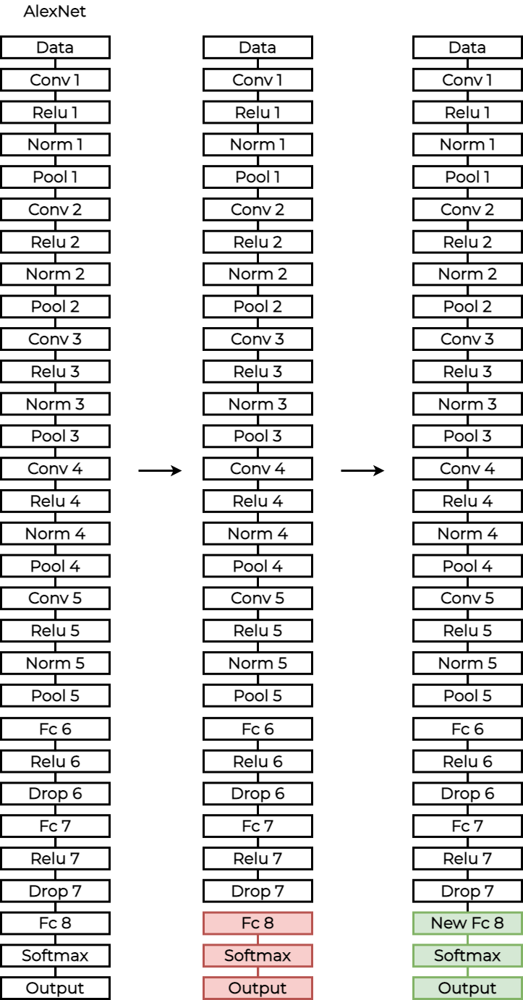
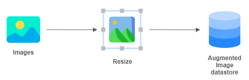
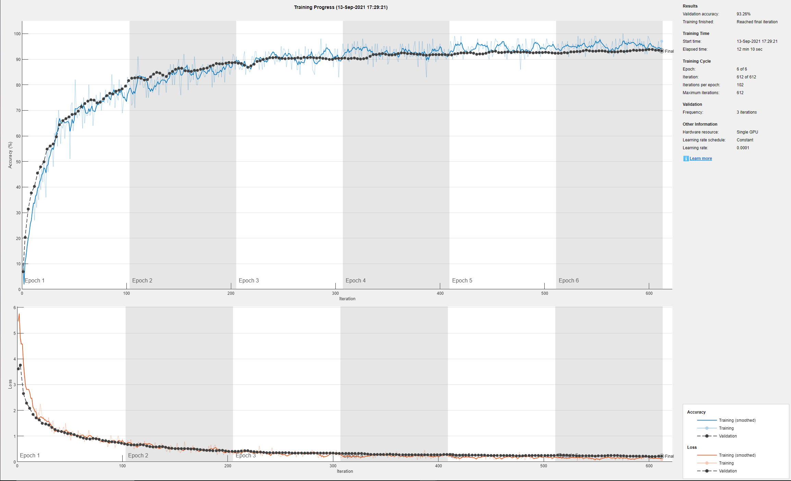
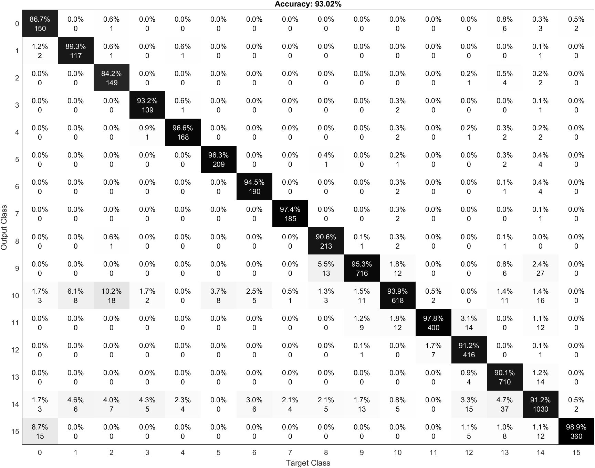
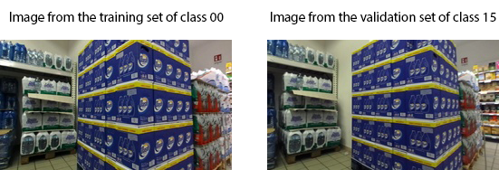

# AlexNet Fine Tuning

This section will explain the fine tuning applied to the pretrained network AlexNet.

# Index

- [Transfer Learning and Fine tuning](#transfer-learning-and-fine-tuning)
- [Fine tuning applied to AlexNet](#fine-tuning-applied-to-alexnet)
- [How the script works](#how-the-script-works)
  * [Variables tuning](#variables-tuning)
    + [Print configuration](#print-configuration)
    + [Other variables](#other-variables)
  * [Import the dataset and split the training set](#import-the-dataset-and-split-the-training-set)
  * [Image resize](#image-resize)
  * [Fine-Tuning](#fine-tuning)
  * [Tune the training options](#tune-the-training-options)
  * [Classification](#classification)
- [Test and output analysis](#test-and-output-analysis)
  * [Confusion matrix](#confusion-matrix)
  * [Error Analysis](#error-analysis)

# Transfer Learning and Fine tuning

Transfer learning consists of taking features learned on one problem, and leveraging them on a new, similar problem. 

The most common incarnation of transfer learning in the context of deep learning is the following workflow:
1. Take layers from a previously trained model.
1. Freeze them, so as to avoid destroying any of the information they contain during future training rounds.
1. Add some new, trainable layers on top of the frozen layers. They will learn to turn the old features into predictions on a new dataset.
1. Train the new layers on your dataset.

A last, optional step, is fine-tuning, which consists of unfreezing the entire model obtained above (or part of it), and re-training it on the new data with a very low learning rate. This can potentially achieve meaningful improvements, by incrementally adapting the pretrained features to the new data.

# Fine tuning applied to AlexNet
In this section we will explain the changes applied to the AlexNet.

The first thing done was to remove the last three layers of the network, because they are configured for 1000 classes. These three layers must be fine-tuned for the new classification problem.

So we add again a fully connected layer with the right number of classes and some parameters tuned. We also add the softmax layer and the output layer at the end.

With fine tuning it is also possible to change the weights of the first layers, but we decided to leave them unchanged



# How the script works
This section will explain how the project works.

## Variables tuning
In the first part of the code it is possible to configure the code variables. This part is useful to enable or disable some parts of the code and to choose which pretrained network to use.

### Print configuration
These variables to enable or disable some part of the code. 
1. Print random images of the training set (0 disabled / 1 enabled)
```
print_training_set = 0;
```
2. Print 12 random images of the test set (0 disabled / 1 enabled). For each of them it shows the number of the image, the prediction of the model and the correct class.
```
print_test_set = 0;
```
3. Print the confusion matrix (0 disabled / 1 enabled).
```
print_conf_matr = 0;
```

### Other variables
The last variable is the number of classes
```
numClasses = 16;
```

## Import the dataset and split the training set
In the second part of the code there will be the import of all the images, using ```imageDataStore```, a function that automatically labels all the images based on the folder names. The images will be stored into an ```ImageDataStore``` object. 

So the program takes the test set images from the folder **TestSet** and it stores them into an ```ImageDataStore``` object. The same thing for the training set.

After we split the Training set into Training and Validation sets. The validation set will be 30% of the training set. 

## Image resize
The networks require different input sizes, in this section the image will be resized to fit the first input layer. To automatically resize the training and test images before they are used as input by the network, the program creates augmented image datastores, it specifies the desired image size, and it uses these datastores as input arguments to activations.



## Fine-Tuning

We take all the layers except the last 3. The last three layers of the pretrained network are configured for 1000 classes. These three layers must be fine-tuned for the new classification problem.

After composing the network with the old and the modified layers. The last three layers have been replaced with a fully connected layer, a softmax layer, and a classification output layer. 

Set the fully connected layer to have the same size as the number of classes in the new data. 

To learn faster in the new layers than in the transferred layers, increase the ```WeightLearnRateFactor``` and ```BiasLearnRateFactor``` values of the fully connected layer.

```matlab
freezedLayers = net.Layers(1:end-3);
layers = [
    freezedLayers
    fullyConnectedLayer(numClasses, ...
        'WeightLearnRateFactor',20, ...
        'BiasLearnRateFactor',20)
    softmaxLayer
    classificationLayer];
```

## Tune the training options

Specify the training options. For transfer learning, keep the features from the early layers of the pretrained network (the transferred layer weights). Train the network for a few epochs. Specify the mini-batch size and validation data.

```matlab
options = trainingOptions('sgdm', ...
    'MiniBatchSize',100, ...
    'MaxEpochs',6, ...
    'InitialLearnRate',1e-4, ...
    'Shuffle','every-epoch', ...
    'ValidationData',augimdsValidation, ...
    'ValidationFrequency',3, ...
    'Verbose',false, ...
    'Plots','training-progress');
```


Train the network
Train the network using the training set, the layers and the options configured before.
```matlab
netTransfer = trainNetwork(augimdsTrain,layers,options);
```

## Classification
Perform the classification using the test set.
```matlab
[YPred,scores] = classify(netTransfer,augimdsTest);
YPred = double(YPred(:,1)) -1;
```

# Test and output analysis
In this section we want to analyze one of the best results obtained by the network. We analyzed the accuracy, the images correctly classified vs. the number of images and the time elapsed. We also analyzed the confusion matrix to understand in which class there are more errors and why.
| Pretrained Network | Accuracy | Correct classified vs. No. Images | Time elapsed (s) | Time elapsed |
|:-:|:-:|:-:|:-:|:-:|
| AlexNet Fine Tuning | 93.68% | 2905 / 3101 | 540.65 | 9 min |

We also analyzed the accuracy and the loss  graphs of the network.



As we can see the accuracy graph shows that the validation and the training lines follow almost the same path.

The same thing can be said about the loss graph. The validation set line and the training set line are almost the same. This means that there’s no overfitting or underfitting.

## Confusion matrix
In this section we analyze the confusion matrix of the network.



As we can see there are many elements of the 0 class that were classified as 14 and 15 and 10. As we can see from the map, 0 - 15 - 14 - 10 have some parts in common, they are linking routes. 

The errors come from photos that are between 0 and 15 or 0 and 14 and so on. For example in the training set we can see photos of route 0 that in the test set are in class 14 and so on.

The same thing can be said for the images of class 2 classified as 10 and the images of class 5 classified as 10.
Error Analysis

## Error Analysis

At the end an analysis of the images misclassified has been done, the major part of them comes from images taken between two routes. 

For example in some images of route 0 we could see route 15. 



It’s possible to see that the images are almost the same.

These errors could be fixed by removing these images, because they generate many errors, or using the real test set with the labels

