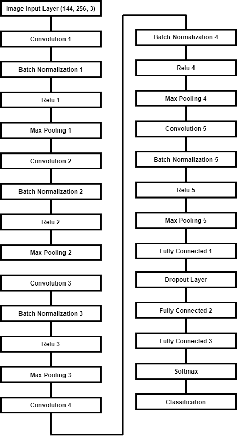
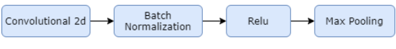
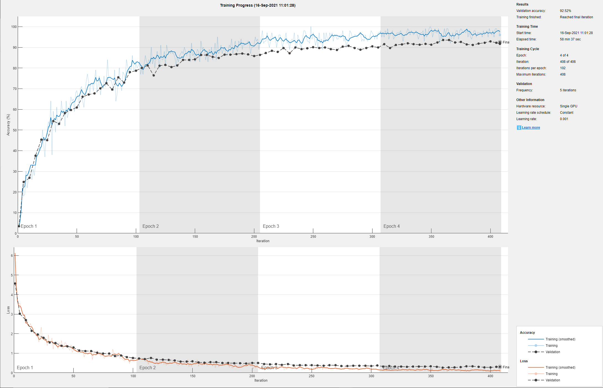
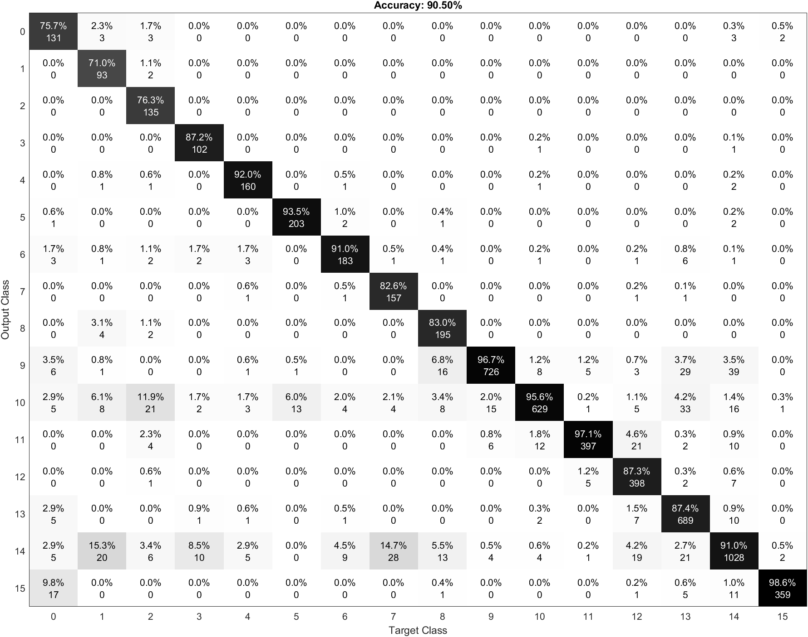
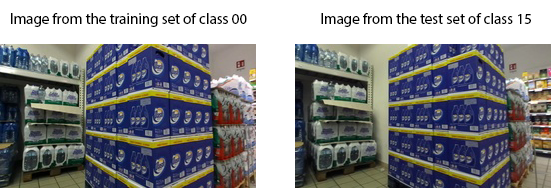

# Creating a new network
The last test consists of creating a new convolutional neural network.

# Index

# Network Structure

The network we created has 28 layers.



In our first try we started with a simple network composed by: a convolution 2d layer + batch normalization layer + relu layer + max pooling layer, then it follows a fully connected layer + softmax and at the end the layer that classifies the feature produced from the convolutional part of the net.

After we added convolutional layers and changed some parameters, like the dimension of the filter, until we reached an optimal result as accuracy.

The final network created has 5 combinations of:



At the end there are 3 fully connected layers, a softmax layer and the classification one. Between the first two fully connected layers there’s a dropout layer.

# How the script works
This section will explain how the project works.

## Variables tuning
In the first part of the code it is possible to configure the code variables. This part is useful to enable or disable some parts of the code and to choose which pretrained network to use.

### Print configuration
These variables to enable or disable some part of the code. 
1. Print random images of the training set (0 disabled / 1 enabled)
```
print_training_set = 0;
```
2. Print 12 random images of the test set (0 disabled / 1 enabled). For each of them it shows the number of the image, the prediction of the model and the correct class.
```
print_test_set = 0;
```
3. Print the confusion matrix (0 disabled / 1 enabled).
```
print_conf_matr = 0;
```

## Import the dataset
In the second part of the code there will be the import of all the images, using ```imageDataStore```, a function that automatically labels all the images based on the folder names. The images will be stored into an ```ImageDataStore``` object. 

So the program takes the test set images from the folder **TestSet** and it stores them into an ```ImageDataStore``` object. The same thing for the training and validation set.

## Image Resize
There is no need to resize the images because the first layer takes in input rgb images with size 256x144, exactly the ones that we have in the dataset.

## Network Creation
In this section we will create the network. So we will show which layers and what parameters are in the network.
```matlab
layers = [
    imageInputLayer([144 256 3])
    
    convolution2dLayer(12,64,'Padding','same')
    batchNormalizationLayer
    reluLayer
    maxPooling2dLayer(3,'Stride',2)
    
    convolution2dLayer(8,96,'Padding','same')
    batchNormalizationLayer
    reluLayer
    maxPooling2dLayer(3,'Stride',2)
    
    convolution2dLayer(6,96,'Padding','same')
    batchNormalizationLayer
    reluLayer
    maxPooling2dLayer(3,'Stride',2)
    
    convolution2dLayer(5,128,'Padding','same')
    batchNormalizationLayer
    reluLayer
    maxPooling2dLayer(3,'Stride',2)
    
    convolution2dLayer(3,64,'Padding','same')
    batchNormalizationLayer
    reluLayer
    maxPooling2dLayer(2,'Stride',2)

    fullyConnectedLayer(128)
    dropoutLayer(0.25)
    fullyConnectedLayer(128)
    fullyConnectedLayer(16)
    softmaxLayer
    classificationLayer];
```

## Training options
We chose **sgdm** as an optimizer. We setted the mini batch size at 100, the number of epochs at 4, the learning rate at 0.001 and the validation frequency at 5.

Next we specify all the training options, the validation set is taken before from the training set . 
```matlab
options = trainingOptions('sgdm', ...
    'MiniBatchSize',100, ...
    'MaxEpochs',4, ...
    'InitialLearnRate',0.001, ...
    'Shuffle','every-epoch', ...
    'ValidationData',imdsValidation, ...
    'ValidationFrequency',5, ...
    'Verbose',false, ...
    'Plots','training-progress');
```

## Train the network
Using the training set, the network and the training options we train the network.
```matlab
netTransfer = trainNetwork(imdsTrain,layers,options);
```

## Classification
At the end we perform the classification.
```matlab
[YPred,scores] = classify(netTransfer,imdsTest);
YPred = double(YPred(:,1)) -1;
```

# Test and output analysis
In this section we want to analyze one of the best results obtained by the network.

We analyzed the accuracy, the images correctly classified vs. the number of images and the time elapsed. 

We also analyzed the confusion matrix to understand in which class there are more errors and why.

The training of the network has been performed using an Nvidia 2060 GPU.

| Pretrained Network | Accuracy | Correct classified vs. No. Images | Time elapsed (s) | Time elapsed |
|:-:|:-:|:-:|:-:|:-:|
| New Network | 90.52% | 5585 / 6171 | 3685.58 | 1 h 1 m 25 s |

We also analyzed the accuracy and the loss graphs of the network.



As we can see the accuracy graph shows that the validation and the training lines follow almost the same path.

The same thing can be said about the loss graph. The validation set line and the training set line are almost the same. This means that there’s no overfitting or underfitting.

## Confusion matrix
In this section we analyze the confusion matrix of the network.



In this confusion matrix it’s possible to see that there are many images of the class 0 classified as 15. The main reason is that 15 has a link with class 0. The errors come from photos that are between 0 and 15, for example a photo of the route 0 in which it is possible to see the route 15 and so on.

The routes 10 and 14 are the ones that produce the most errors, in fact analyzing row 10 and 14 of the confusion matrix we can see that for almost every class there are misclassified images. 


## Error Analysis

As we did with the other test, at the end we analyzed the misclassified images and we saw that the major part of them comes from images taken between two routes. 

For example in some images of route 0 we could see route 15. 



It’s possible to see that the images are almost the same.

These errors could be fixed by removing these images, because they generate many errors.

