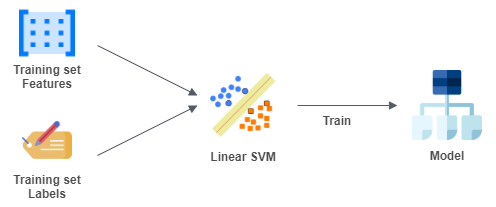
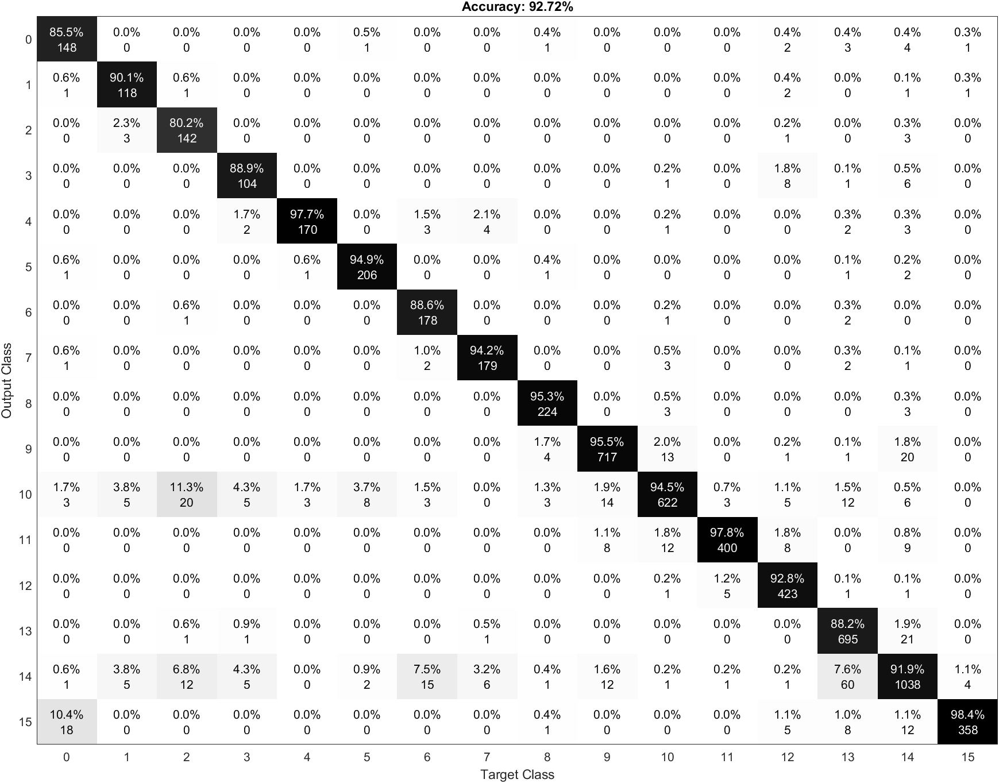
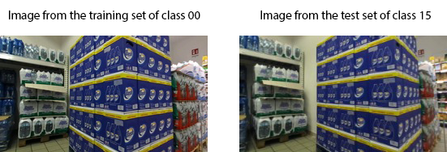

# Feature extraction using pretrained networks

This section will show the classification performed using pretrained networks to extract the features and linear SVM. In this section we show which pretrained networks have been used in this project, what the code does and the result obtained.

# Index

- [Pretrained Networks](#pretrained-networks)
  * [AlexNet](#alexnet)
  * [ResNet18](#resnet18)
  * [VGG16](#vgg16)
- [How the project works](#how-the-project-works)
  * [Variables tuning](#variables-tuning)
    + [Print configuration](#print-configuration)
    + [Network selection](#network-selection)
  * [Import the dataset and split the training set](#import-the-dataset-and-split-the-training-set)
  * [Image resize](#image-resize)
  * [Select the activation layer for the feature extraction and extract the features](#select-the-activation-layer-for-the-feature-extraction-and-extract-the-features)
  * [Classification](#classification)
- [Test and output analysis](#test-and-output-analysis)
  * [Confusion matrix](#confusion-matrix)
    + [AlexNet](#alexnet-1)
    + [ResNet 18](#resnet-18)
    + [VGG 16](#vgg-16)
  * [Error Analysis](#error-analysis)

# Pretrained Networks

A pretrained network is a network that has already learned to extract powerful and informative features from natural images. It can be used as a starting point to learn a new task.

Many of the pretrained networks used in this project have been trained with the same
[ImageNet](http://www.image-net.org) database. These pretrained networks can classify images into 100 object categories, such as keyboard, mouse, pencil and many animals.

## AlexNet
AlexNet is a convolutional neural network that is 8 layers deep.  The network has an image input size of 227x227.

To see the structure of the network in matlab you have to put these lines in the command window:
<details>
<summary>Expand</summary>

```
net = alexnet;
```
After
```
net.Layers;
OR
analyzeNetwork(net)
```
</details>


## ResNet18
The ResNet-18 is a convolutional neural network that is 18 layers deep. The network has an image input size of 244x244.

To see the structure of the network in matlab you have to put these lines in the command window:
<details>
<summary>Expand</summary>

```
net = resnet18;
```
After
```
net.Layers;
OR
analyzeNetwork(net)
```
</details>


## VGG16
VGG16 is a convolutional neural network that is 16 layers deep. The network has an image input size of 224x224.

To see the structure of the network in matlab you have to put these lines in the command window:
<details>
<summary>Expand</summary>

```
net = vgg16;
```
After
```
net.Layers;
OR
analyzeNetwork(net)
```
</details>

# How the project works
This section will explain how the project works.

## Variables tuning
In the first part of the code it is possible to configure the code variables. This part is useful to enable or disable some parts of the code and to choose which pretrained network to use.

### Print configuration
These variables to enable or disable some part of the code. 
1. Print random images of the training set (0 disabled / 1 enabled)
```
print_training_set = 0;
```
2. Print 12 random images of the test set (0 disabled / 1 enabled). For each of them it shows the number of the image, the prediction of the model and the correct class.
```
print_test_set = 0;
```
3. Print the confusion matrix (0 disabled / 1 enabled).
```
print_conf_matr = 0;
```

### Network selection
It is possible to select one of the pretrained networks between **AlexNet**, **ResNet-18** and **VGG16**.

```
network = "alexnet";
% network = "resnet";
% network = "vgg"
```

## Import the dataset and split the training set
In the second part of the code there will be the import of all the images, using ```imageDataStore```, a function that automatically labels all the images based on the folder names. The images will be stored into an ```ImageDataStore``` object. 

So the program takes the test set images from the folder **TestSet** and it stores them into an ```ImageDataStore``` object. The same thing for the training set.

## Image resize
The networks require different input sizes, in this section the image will be resized to fit the first input layer. To automatically resize the training and test images before they are used as input by the network, the program creates augmented image datastores, it specifies the desired image size, and it uses these datastores as input arguments to activations.


## Select the activation layer for the feature extraction and extract the features
The network constructs a hierarchical representation of input images. Deeper layers contain higher-level features, constructed using the lower-level features of earlier layers. 

To get the feature representations of the training and test images, the program will use activations on different layers depending on the network used. 

In the project case for **alexnet** is **fc7**, for **resnet18** is **pool5** and for **vgg16** is **fc7**. 
This parameter can be changed. Basically the code is extracting the feature from the layer before the layer that actually classifies the things.

At the end of this step there will be the features of the training and test sets.


## Classification
The next step is to perform the creation of the model using the training set features and labels, and after to perform the classification using the model, the feature of the test set and the labels of the test set. At the end the program computes the accuracy.

The library used to use linears svm to perform the classification is [liblinear](https://www.csie.ntu.edu.tw/~cjlin/liblinear/). So, after the conversion of the data to the one compatible with liblinear, the program trains the model passing the labels and the features. After it performs the predictions using the labels and the features of the test set and the model generated before. At the end it computes the accuracy.

In the first rows of the code there are the conversions of the data to the one compatible with liblinear. 

In the next part of the code there is training of the model, passing to the function the labels and the features. To train the model there is an option (```-s 2```) to use the **L2-regularized L2-loss support vector classification (primal)**. The default is **L2-regularized L2-loss support vector classification (dual)**, but it gives many warnings because it reaches the max number of iterations.



After there is the prediction using the labels and the features of the test set and the model generated before.


At the end the program computes the accuracy.
```matlab
YTrain = double(YTrain(:,1));
YTest = double(YTest(:,1));
featuresTrain = sparse(double(featuresTrain));
featuresTest = sparse(double(featuresTest));
model = train(YTrain, featuresTrain, '-s 2');
YPred = predict(YTest, featuresTest, model);
accuracy = mean(YPred == YTest)
```

# Test and output analysis
The program ran with every net and for each of them the accuracy, the images correctly classified vs. the number of images and the time elapsed has been compared. 

For each pretrained network the confusion matrix has been plotted to understand in which classes there are more errors.

| Pretrained Network | Accuracy | Correct Classified vs No. of images | Time Elasped (s) | Time Elasped |
|:---:|:---:|:---:|:---:|:---:|
| AlexNet | 93.00% | 2884 / 3101 | 125.51 | 2 min 5 s |
| ResNet-18 | 92.52% | 2869 / 3101 | 254.52 | 4 min 14 s |
| VGG16 | 92.33% | 2863 / 3101 | 1595.04 | 26 min 35 s |

Here it’s possible to see that the accuracy is almost the same for each pretrained network, but **AlexNet** is the fastest in terms of time elapsed.

## Confusion matrix
For each pretrained network we computed the confusion matrix.

### AlexNet


In this confusion matrix it’s possible to see that there are many images of the class 6 classified as 14. The main reason is that 14 is a route that has a link with every other class except 10. The errors come from photos that are between 6 and 14, for example a photo of the route 6 in which it is possible to see the route 14 and so on.

It is also possible to notice images of route 11 classified as 9 and also images of the 15 classified as 14. These errors are caused by the same reason explained before.

### ResNet 18


In this confusion matrix it’s possible to see images of the class 7 classified as 14 and images of 11 classified as 9. The reason is the same as explained before.

### VGG 16



In this confusion matrix it’s possible to see images of the class 5 and 6 classified as 14 and images of 11 classified as 9. The reason is the same as explained before.

## Error Analysis

At the end an analysis of the images misclassified has been done, almost the totality of them comes from images taken between two routes. 

For example in some images of route 0 we could see route 15. 



It’s possible to see that the images are almost the same.

These errors could be fixed by removing these images, because they generate many errors, or using the real test set with the labels