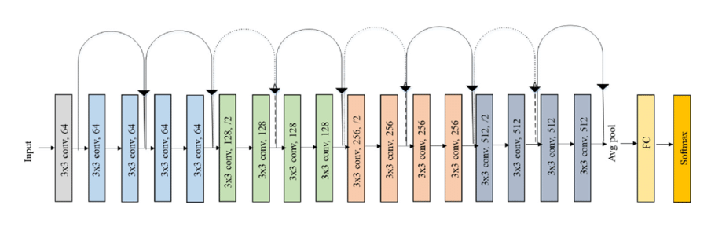

# Deep-Learning-Supermarket
This project tries to understand the position of a person in a supermarket using image classification and deep learning.
The images are taken from a [dataset](https://iplab.dmi.unict.it/MLC2018/). These images has been taken following some routes inside the supermarket. After that they have been divided into 16 classes.  


The feature extraction part will be perfomed using three pretrained networks:
* AlexNet
* ResNet18
* VGG16

The classification part will be perfomed using linear SVMs.

# Index

# Pretrained Networks

## AlexNet
AlexNet is a convolutional neural network that is 8 layers deep. The pretrained version has more than a milion images from the [ImageNet](http://www.image-net.org) database. This pretrained network can classify images into 100 object categories, such as keyboard, mouse, pencil and many animals. The network has an image input size of 227x227. 

## ResNet18
The ResNet-18 is a convolutional neural network that is 18 layer deep. The pretrained version has more than a milion images from the [ImageNet](http://www.image-net.org) database. This pretrained network can classify images into 100 object categories, such as keyboard, mouse, pencil and many animals. The network has an image input size of 244x244.



## VGG16

# Dataset Organization
The first step to do is to organize the images into folders. The zip file is divided into a folder that contains all the images and three csv files:
* **training_set**: that contains all the images to use to train the knn
* **validation_set**: that contains all the images to use to verify the accuracy
* **test_set**: that contains all the images to use to run the algorithm

The first two csv files have 6 columns:
* Image name
* x coordinate
* y coordinate
* u coordinate
* z coordinate
* Class

We used just the first file and we removed all the coordinates columns, because we don't need the position in which the photo was taken, we need just the name of the file and the class.

Using a bash script file we divided all the images into folders from 00 to 15 based on their class.

The images folder won't be in this repository because the dimension is too high for github.

# How the project works
In this section we will explain how the project works.

## Import the dataset and split the training set
In the first part of the code we will import all the images using ```imageDataStore``` a function that automatically labels all the images based on the folder names. The images will be stored into an ```ImageDataStore``` object. After that we split each label into **training** and into **validation** set. We chose to split into 70% training and 30% test.

## Pretrained network selection
The next step is to choose which pretrained network use to extract the features In the code there is a part in which is possible to select which neural network use:
```
net = alexnet;
% net = resnet18;
% net = vgg16;
```

# How to run the project
In this section we will explain how to run the project

## Preliminary steps
1. Install the matlab Deep Learning Toolbox Add On: Home > Add-On > Deep Learning Toolbox

2. Install the matlab Deep Learning Toolbox Model for AlexNet Network Add On: Home > Add-On > Deep Learning Toolbox Model for AlexNet Network

3. Install the matlab Deep Learning Toolbox Model for ResNet-18 Network Add On: Home > Add-On > Deep Learning Toolbox Model for ResNet-18 Network

4. Install the matlab Deep Learning Toolbox Model for VGG-16 Network Add On: Home > Add-On > Deep Learning Toolbox Model for VGG-16 Network

## Pretrained network selection
The next step is to choose which pretrained network use to extract the features In the code there is a part in which is possible to select which neural network use:
```
net = alexnet;
% net = resnet18;
% net = vgg16;
```
