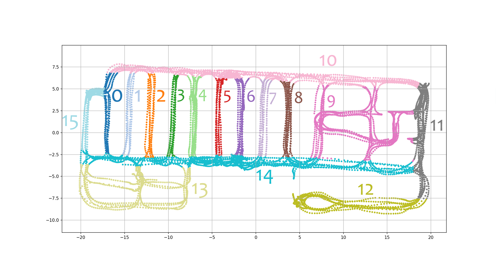

# Deep-Learning-Supermarket
The objective of this project is to try to understand the position of a person in a supermarket using image classification and deep learning.

The images of the supermaket are taken from a [dataset](https://iplab.dmi.unict.it/MLC2018/). These images have been taken by a camera attached to a cart that followed some routes inside the supermarket. After the acquisition they have been divided into 16 classes/routes.    



With this dataset we will perform three different tests:
* Feature extraction using three pretrained networks:
  * AlexNet
  * ResNet18
  * VGG16  
and perform the classification using linear SVMs.
* Fine tuning using an ImageNet pretrained network
* Classification creating a new network

More info on the tests:
1. [Feature extraction using pretrained networks](https://github.com/thisispivi/Deep-Learning-Supermarket/blob/main/PRETRAINED.md)
1. [Fine-tuning](https://github.com/thisispivi/Deep-Learning-Supermarket/blob/main/FINETUNING.md)
1. [New network](https://github.com/thisispivi/Deep-Learning-Supermarket/blob/main/NEWNETWORK.md)


# Index
- [Files Structure](#files-structure)
- [Dataset Organization](#dataset-organization)
- [How to run the project](#how-to-run-the-project)
  * [Preliminary steps](#preliminary-steps)
  * [Dataset organization](#dataset-organization)
    + [Download our organized dataset](#download-our-organized-dataset)
    + [Download and manually organize the original dataset](#download-and-manually-organize-the-original-dataset)
  * [Variables configuration](#variables-configuration)
  * [Run the script](#run-the-script)

# Files Structure
```
.
|
| Folders
├── img   # Images for the readme
├── doc   # Report folder
│   ├── Report.pdf   # Report
├── *TrainingSet*   # Folder with the images of the training set
│   ├── 00
│   ├── 01
│   ├── ...
│   ├── 14
│   └── 15
├── *TestSet*   # Folder with the images of the validation set
│   ├── 00
│   ├── 01
│   ├── ...
│   ├── 14
│   └── 15
|
| Markdown
├── README.md
├── PRETRAINED.md
├── FINETUNING.md
├── NEWNETWORK.md
|
| Liblinear
├── libsvmread.mexw64   # Read
├── libsvmwrite.mexw64   # Write
├── train.mexw64   # File with train function
├── predict.mexw64   # File with predict function
|
| Matlab Script
├── fine_tuning.mlx   # Script for the AlexMet fine tuning
├── new_network.mlx   # Script for new Network
└── pretrained_networks.mlx   # Script for the pretrained feature extraction
```

Folders with * are not included in the repository.

# Dataset Organization
The first step to do is to organize the images into folders. The zip file is made by a folder that contains all the images and three csv files:
* **training_set**: that contains all the images to use to train the pretrained network
* **validation_set**: that contains all the images to use to verify the accuracy
* **test_set**: that contains all the images to use to run the algorithm

The first two csv files have 6 columns:
* Image name
* x coordinate
* y coordinate
* u coordinate
* z coordinate
* Class

Just the first two files have been used and all the coordinate columns have been removed, because the position in which the photo was taken it’s not necessary. So just the name of the file and the class have been used.

In both the training and the validation set, using a bash script file, all the images have been divided into folders from 00 to 15 based on their class.

The **test_set** file hasn’t been used because it has no label. This means that when the network creates the predictions there is no way to check if the classes are right. So we decided to use the **validation_set** as the test set and when we need the validation set we **split the training_set**. 

So there are two folders:
1. **TestSet**: in which there are all the test set images
1. **TrainingSet**: in which there are all the training set images

The images folder won't be in this repository because the size is too high for github.

The organized dataset that has been used can be downloaded [here](https://mega.nz/file/VZ0ShDyI#_1tMgy4y_AEkdYv2BERWRVfuXxc07RWdKVL2V8p54cw).

# How to run the project
This section will explain how to run the project

## Preliminary steps

1. Clone the repository
```shell script
git clone https://github.com/thisispivi/Deep-Learning-Supermarket
```

2. Open the matlab file ```script.mlx```, or the normal matlab script: ```script_no_live.m```

1. Install the matlab Statistic and Machine Learning Toolbox Add On: Home > Add-On > Statistic and Machine Learning Toolbox

2. Install the matlab Deep Learning Toolbox Model for AlexNet Network Add On: Home > Add-On > Deep Learning Toolbox Model for AlexNet Network

3. Install the matlab Deep Learning Toolbox Model for ResNet-18 Network Add On: Home > Add-On > Deep Learning Toolbox Model for ResNet-18 Network

4. Install the matlab Deep Learning Toolbox Model for VGG-16 Network Add On: Home > Add-On > Deep Learning Toolbox Model for VGG-16 Network

5. Install the Plot Confusion Matrix Add On: Home > Add-On > Plot Confusion Matrix by Vane Tshitoyan

## Dataset organization
Here there are two options:

### Download our organized dataset
Download the organized dataset we used from this [link](https://mega.nz/file/VZ0ShDyI#_1tMgy4y_AEkdYv2BERWRVfuXxc07RWdKVL2V8p54cw).

### Download and manually organize the original dataset
1. Download the original [dataset](https://iplab.dmi.unict.it/MLC2018/)

2. With the help of online tools remove the coordinates columns from the csv files

3. Take the training set images and put them inside a new folder called **TrainingSet** in the root of the project

4. Take the validation set images and put them inside a new folder called **ValidationSet** in the root of the project

## Variables configuration
The next step is to configure the variables of the first section. Here there's one of the most important thing to do: choosing which pretrained network use to extract the features. To select one you have to uncomment.
```
% network = "alexnet";
% network = "resnet";
% network = "vgg"
```

**(Optional)**

Configure the other variables

## Run the script
The only thing left is to run the script


