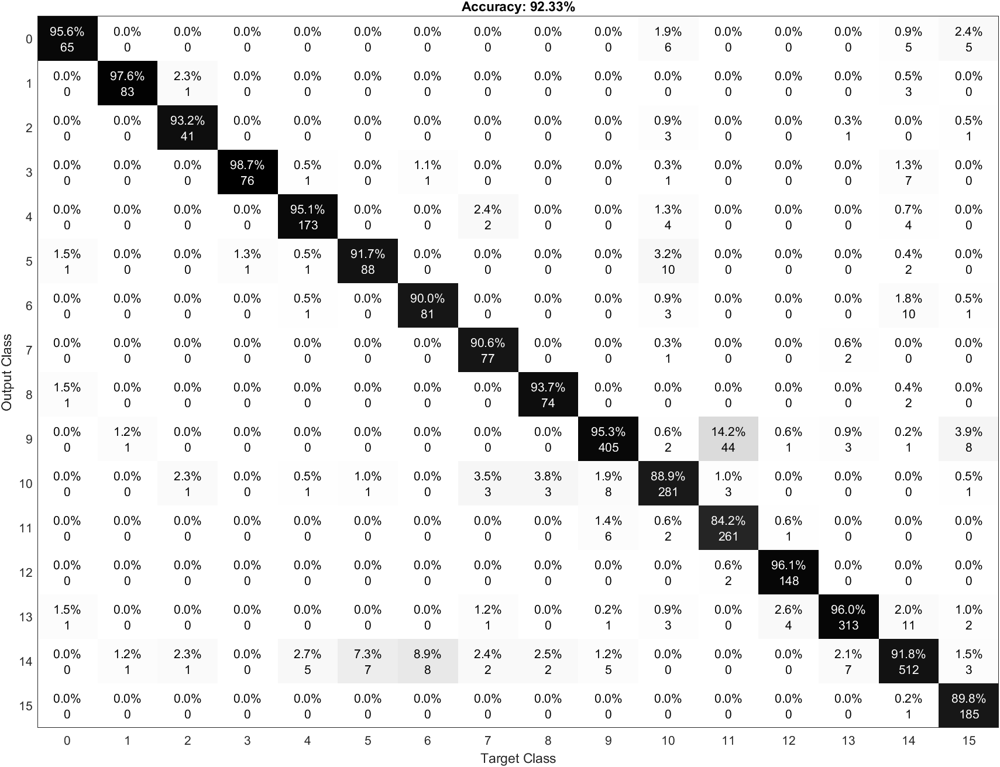

# Deep-Learning-Supermarket
This objective of this project is to try to understand the position of a person in a supermarket using image classification and deep learning.

The images of the supermaket are taken from a [dataset](https://iplab.dmi.unict.it/MLC2018/). These images has been taken by a camera attached to a cart that followed some routes inside the supermarket. After the acquisition they have been divided into 16 classes/routes.  


With this dataset we will perform the feature extraction using three pretrained networks:
* AlexNet
* ResNet18
* VGG16

After that we will perfom the classification using linear SVMs.

# Index
- [Pretrained Networks](#pretrained-networks)
  * [AlexNet](#alexnet)
  * [ResNet18](#resnet18)
  * [VGG16](#vgg16)
- [Dataset Organization](#dataset-organization)
- [How the project works](#how-the-project-works)
  * [Variables tuning](#variables-tuning)
    + [Print configuration](#print-configuration)
    + [Classification Version](#classification-version)
    + [Network selection](#network-selection)
  * [Import the dataset and split the training set](#import-the-dataset-and-split-the-training-set)
  * [Image resize](#image-resize)
  * [Select the activation layer for the feature extraction and extract the features](#select-the-activation-layer-for-the-feature-extraction-and-extract-the-features)
  * [Classification](#classification)
    + [Matlab Version](#matlab-version)
    + [Liblinear Version](#liblinear-version)
- [How to run the project](#how-to-run-the-project)
  * [Preliminary steps](#preliminary-steps)
  * [Dataset organization](#dataset-organization)
  * [Variables configuration](#variables-configuration)
  * [Run the script](#run-the-script)
- [Test and output analysis](#test-and-output-analysis)
  * [Accuracy](#accuracy)
  * [Confusion matrix](#confusion-matrix)
    + [AlexNet](#alexnet-1)
    + [ResNet](#resnet)
    + [VGG](#vgg)

# Pretrained Networks
In this section we will show which are the pretrained network that we used in this project. 

A pretrained network is a network that has already learned to extract powerful and informative features from natural images. It can be used as a starting point to learn a new task.

Many of the pretrained network used in this project has been trained with the same [ImageNet](http://www.image-net.org) database. These pretrained network can classify images into 100 object categories, such as keyboard, mouse, pencil and many animals.

## AlexNet
AlexNet is a convolutional neural network that is 8 layers deep.  The network has an image input size of 227x227.

To see the structure of the network in matlab you have to put these lines in the command window:
<details>
<summary>Expand</summary>

```
net = alexnet;
```
After
```
net.Layers;
OR
analyzeNetwork(net)
```
</details>


## ResNet18
The ResNet-18 is a convolutional neural network that is 18 layer deep. The network has an image input size of 244x244.

To see the structure of the network in matlab you have to put these lines in the command window:
<details>
<summary>Expand</summary>

```
net = resnet18;
```
After
```
net.Layers;
OR
analyzeNetwork(net)
```
</details>


## VGG16
VGG16 is a convolutional neural network that is 16 layers deep. The network has an image input size of 224x224.

To see the structure of the network in matlab you have to put these lines in the command window:
<details>
<summary>Expand</summary>

```
net = vgg16;
```
After
```
net.Layers;
OR
analyzeNetwork(net)
```
</details>


# Dataset Organization
The first step to do is to organize the images into folders. The zip file is made by a folder that contains all the images and three csv files:
* **training_set**: that contains all the images to use to train the knn
* **validation_set**: that contains all the images to use to verify the accuracy
* **test_set**: that contains all the images to use to run the algorithm

The first two csv files have 6 columns:
* Image name
* x coordinate
* y coordinate
* u coordinate
* z coordinate
* Class

We used just the first two files and we removed all the coordinates columns, because we don't need the position in which the photo was taken, we need just the name of the file and the class.

For both the training and the validation set, using a bash script file, we divided all the images into folders from 00 to 15 based on their class.

So we have two folders:
1. **ValidationSet**: in which we can find all the validation set images
2. **TrainingSet**: in which we can find all the training set images

The images folder won't be in this repository because the size is too high for github.

# How the project works
In this section we will explain how the project works.

## Variables tuning
In the first part of the code it is possible to configure the code variables. This part is useful to enable or disable some parts of the code, or to choose which classification version or pretrained network use.
### Print configuration
These variables to enable or disable some part of the code. 
1. Print random images of the training set (0 disabled / 1 enabled)
```
print_training_set = 0;
```
2. Print 12 random images of the test set (0 disabled / 1 enabled). For each of them it shows the number of the image, the prediction of the model and the correct class.
```
print_test_set = 0;
```
3. Print the confusion matrix (0 disabled / 1 enabled).
```
print_conf_matr = 0;
```
### Classification Version
It is possible to choose between two classifier versions:
1. Matlab: following the matlab tutorials on how to extract features there is the possibility to use the function *fitcecoc* to create a classifier and then generate the predictions.
```
classification_version = "matlab";
```
2. Liblinear: we use the [liblinear](https://www.csie.ntu.edu.tw/~cjlin/liblinear/) library to use linears svm to perform the classification. So, after the conversion of the data to the one compatible to liblinear, we train the model passing the labels and the features. After we perform the predictions using the labels and the features of the test set and the model generated before. At the end we compute the accuracy.
```
classification_version = "liblinear";
```
### Network selection
It is possible to select one of the pretrained network between **AlexNet**, **ResNet-18** and **VGG16**.

```
network = "alexnet";
% network = "resnet";
% network = "vgg"
```

## Import the dataset and split the training set
In the second part of the code we will import all the images using ```imageDataStore``` a function that automatically labels all the images based on the folder names. The images will be stored into an ```ImageDataStore``` object. 

So we take the validation set images from the folder **ValidationSet** and we store into an ```ImageDataStore``` object. The same thing for the training set.

## Image resize
The networks require different input size, in this section the image will be resized to fit the first input layer. To automatically resize the training and test images before they are input to the network, create augmented image datastores, specify the desired image size, and use these datastores as input arguments to activations.


## Select the activation layer for the feature extraction and extract the features
The network constructs a hierarchical representation of input images. Deeper layers contain higher-level features, constructed using the lower-level features of earlier layers. 

To get the feature representations of the training and test images, we will use activations on different layers depending on the network used. 

In our case for **alexnet** is **fc7**, for **resnet18** is **pool5** and for **vgg16** is **fc7**. 

This parameter can be changed. Basically we are extracting the feature from the layer before the layer that actually classify the things.

At the end of this step we will have the features of the training and test sets.


## Classification
The next step is to perform the creation of the model using the training set features and labels, and after to perform the classification using the model, the feature of the test set and the labels of the test set. At the end we compute the accuracy.

There are two different version to do this: **matlab** and **liblinear**.

### Matlab Version
Following the matlab tutorials on how to extract features there is the possibility to use the function fitcecoc to create a classifier and then generate the predictions. At the end it is possible to compute the accuracy.

```matlab
classifier = fitcecoc(featuresTrain,YTrain);
YPred = predict(classifier,featuresTest);
accuracy = mean(YPred == YTest);
```

### Liblinear Version
Here we use the liblinear library to use linears svm to perform the classification. 

In the first rows of the code there are the conversions of the data to the one compatible to liblinear. 

Next we train the model passing the labels and the features. To train the model we insert an option (```-s 2```) to use the **L2-regularized L2-loss support vector classification (primal)**. The default is **L2-regularized L2-loss support vector classification (dual)**, but it gives many warning because it reaches the max number of iterations.


After we perform the prediction using the labels and the features of the test set and the model generated before. 


At the end we compute the accuracy.
```matlab
YTrain = double(YTrain(:,1));
YTest = double(YTest(:,1));
featuresTrain = sparse(double(featuresTrain));
featuresTest = sparse(double(featuresTest));
model = train(YTrain, featuresTrain, '-s 2');
YPred = predict(YTest, featuresTest, model);
accuracy = mean(YPred == YTest)
```

# How to run the project
In this section we will explain how to run the project

## Preliminary steps
1. Install the matlab Statistic and Machine Learning Toolbox Add On: Home > Add-On > Statistic and Machine Learning Toolbox

2. Install the matlab Deep Learning Toolbox Model for AlexNet Network Add On: Home > Add-On > Deep Learning Toolbox Model for AlexNet Network

3. Install the matlab Deep Learning Toolbox Model for ResNet-18 Network Add On: Home > Add-On > Deep Learning Toolbox Model for ResNet-18 Network

4. Install the matlab Deep Learning Toolbox Model for VGG-16 Network Add On: Home > Add-On > Deep Learning Toolbox Model for VGG-16 Network

5. Install the Plot Confusion Matrix Add On: Home > Add-On > Plot Confusion Matrix by Vane Tshitoyan

## Dataset organization

## Variables configuration
The next step is to configure the variables of the first section. Here there's one of the most important thing to do: choosing which pretrained network use to extract the features. To select one you have to uncomment.
```
% network = "alexnet";
% network = "resnet";
% network = "vgg"
```

## Run the script
The only thing left is to run the script

# Test and output analysis

## Accuracy

| Pretrained Network | Accuracy | True Positive vs No. of images | Time Elasped (s) | Time Elasped |
|:---:|:---:|:---:|:---:|:---:|
| AlexNet | 93.00% | 2884 / 3101 | 125.51 | 2 min 5 s |
| ResNet-18 | 92.52% | 2869 / 3101 | 254.52 | 4 min 14 s |
| VGG16 | 92.33% | 2863 / 3101 | 1595.04 | 26 min 35 s |

## Confusion matrix
For each pretrained network we computed the confusion matrix.

### AlexNet


### ResNet


### VGG

